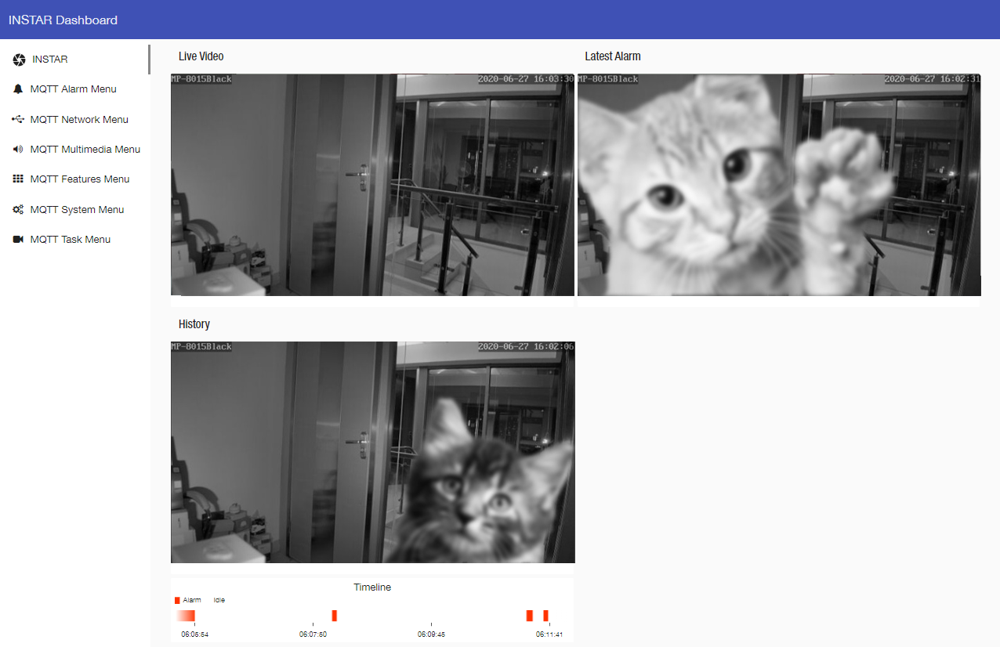
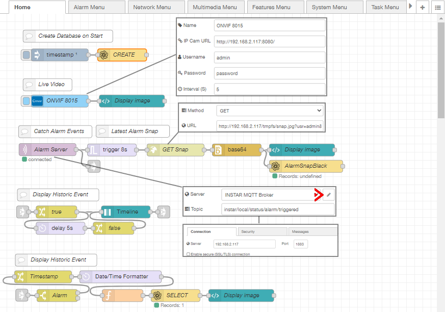
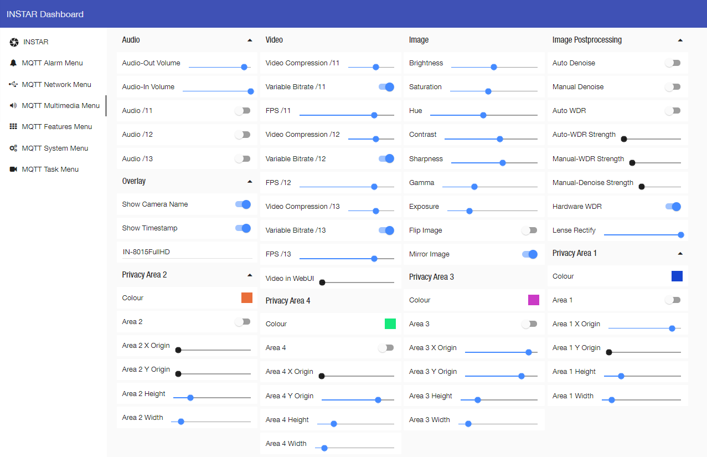

# Run a INSTAR Node-RED Dashboard in Docker





<!-- TOC -->

- [Install Docker on Ubuntu 20.04](#install-docker-on-ubuntu-2004)
- [Download Node-RED Configuration](#download-node-red-configuration)
- [Run Node-RED in Docker](#run-node-red-in-docker)
- [Configuring your Dashboard](#configuring-your-dashboard)
    - [Used Node-RED Nodes:](#used-node-red-nodes)

<!-- /TOC -->

<br/><br/>

Docker is an application that simplifies the process of managing application processes in containers. Containers let you run your applications in resource-isolated processes. They’re similar to virtual machines, but containers are more portable, more resource-friendly, and more dependent on the host operating system.


## Install Docker on Ubuntu 20.04

First, update your existing list of packages:

```bash
sudo apt update
```

Next, install a few prerequisite packages:


```bash
sudo apt install apt-transport-https ca-certificates curl software-properties-common
```


Then add the GPG key for the official Docker repository:


```bash
curl -fsSL https://download.docker.com/linux/ubuntu/gpg | sudo apt-key add -
```

Add the Docker repository to APT sources:


```bash
sudo add-apt-repository "deb [arch=amd64] https://download.docker.com/linux/ubuntu focal stable"
```


Now update the package database with the Docker packages:


```bash
sudo apt update
```


Finally, install Docker:


```bash
sudo apt install docker-ce
```

Docker should now be installed, the daemon started, and the process enabled to start on boot. Check that it’s running:


```bash
sudo systemctl status docker

docker.service - Docker Application Container Engine
     Loaded: loaded (/lib/systemd/system/docker.service; enabled; vendor preset: enabled)
     Active: active (running)
```


If you want to avoid typing sudo whenever you run the docker command, add your username to the docker group:


```bash
sudo usermod -aG docker ${USER}
```


To apply the new group membership, log out of the server and back in, or type the following:


```bash
su - ${USER}
```


Now test that everything is set up by typing:


```bash
docker info
```


## Download Node-RED Configuration


We now need a folder that the Node-RED container can use to persist it's data. Clone or download this repository and save it into the `/opt` directory. Make sure that the Docker user has access to this directory and is allowed to write into it. E.g. :


```bash
chown -R nodered:nodered /opt/nodered/*
chmod -R 777 /opt/nodered
```


## Run Node-RED in Docker

Start by pulling the [official Node-RED image from Docker Hub](https://hub.docker.com/r/nodered/node-red):


```bash
docker pull nodered/node-red:latest
```


Now run the Node-RED container with the following command:


```bash
docker run -d --rm --privileged --net=host -v /opt/nodered/data:/data --name nodered nodered/node-red:latest
```

| | |
| -- | -- |
| `-d`  | Run the container `detached` from my terminal in the background |
| `-rm` | When I stop the container remove it |
| `--privileged` | This is a bit like running the process with _sudo_ and prevents you from running into LINUX security restrictions. You can remove this flag. If your permissions are set correctly the container should work without it. |
| `--net=host` | Usually Docker container are executed in an virtual network. To be able to access a service outside of localhost you have to open the necessary ports - you can replace this flag with `-p 1880:1880` to only open the port that the Node-RED UI needs. If you install additional services in Node-RED that requirer different ports you have to add all of them in the __RUN__ command. Setting the network to `host` is just a shortcut for local development. |
| `-v /opt/Node-RED/data:/data` | This mounts the folder that you created into the container. All data that is stored by Node-RED inside the container will be persisted inside this folder. |
| `--name nodered` | Give your container a name so you can address it by this name instead of having to know it's ID |
| `nodered/node-red:latest` | Is the image that you want to spin up into this container |


## Configuring your Dashboard

### Used Node-RED Nodes:

* [node-red-contrib-ui-state-trail](https://flows.nodered.org/node/node-red-contrib-ui-state-trail)
* [node-red-contrib-onvif](https://flows.nodered.org/node/node-red-contrib-onvif) (Optional - [there are other ways to embed the live video](https://wiki.instar.com/Advanced_User/Node-RED_Dashboard_Live_Video/))
* [node-red-contrib-moment](https://flows.nodered.org/node/node-red-contrib-moment)
[node-red-contrib-alasql](https://flows.nodered.org/node/node-red-contrib-alasql)
* [node-red-node-base64](https://flows.nodered.org/node/node-red-node-base64)





To connect your INSTAR Full HD camera you need to:

1. Double-click the ONVIF node and add you cameras [IP Address](https://wiki.instar.com/Web_User_Interface/1080p_Series/Network/IP_Configuration/), [ONVIF Port](https://wiki.instar.com/Web_User_Interface/1080p_Series/Network/ONVIF/) and [Admin Login](https://wiki.instar.com/Web_User_Interface/1080p_Series/System/User/).
2. Double-click the __GET Snap__ HTTP node and add your cameras [snapshot URL](https://wiki.instar.com/Indoor_Cameras/IN-8015_HD/Video_Streaming/):
     * JPG Path 1: `http://192.168.x.x/tmpfs/snap.jpg?usr=usernam&pwd=password`
     * JPG Path 2: `http://192.168.x.x/tmpfs/auto.jpg?usr=usernam&pwd=password`
     * JPG Path 3: `http://192.168.x.x/tmpfs/auto2.jpg?usr=usernam&pwd=password`
3. Double-click the __Alarmserver__ MQTT IN node and click to edit the __Server__ (Broker). Now you can add your cameras [MQTT broker configuration](https://wiki.instar.com/Advanced_User/INSTAR_MQTT_Broker/Node-RED/).This is the broker that is used by all MQTT nodes - so you only have to change it in one place. __Note__ that if you are using an external MQTT Broker and your camera is connected as a client you can use your broker configuration here. __But__ you will have to change the MQTT Topics in __ALL__ MQTT nodes from the [local topic to the camera specific topic using your cameras MQTT ID](https://wiki.instar.com/Advanced_User/INSTAR_MQTT_Broker/).


